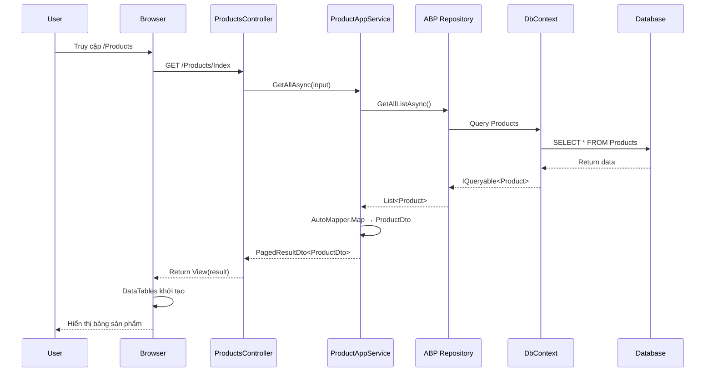
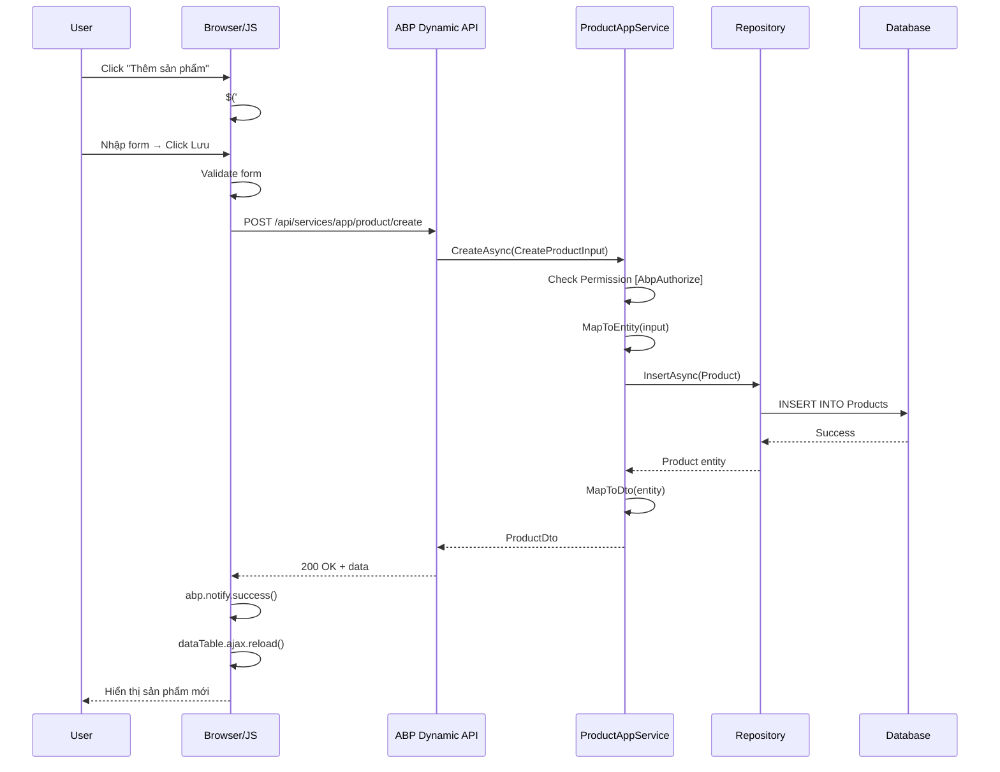
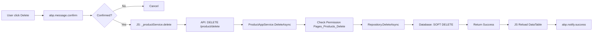
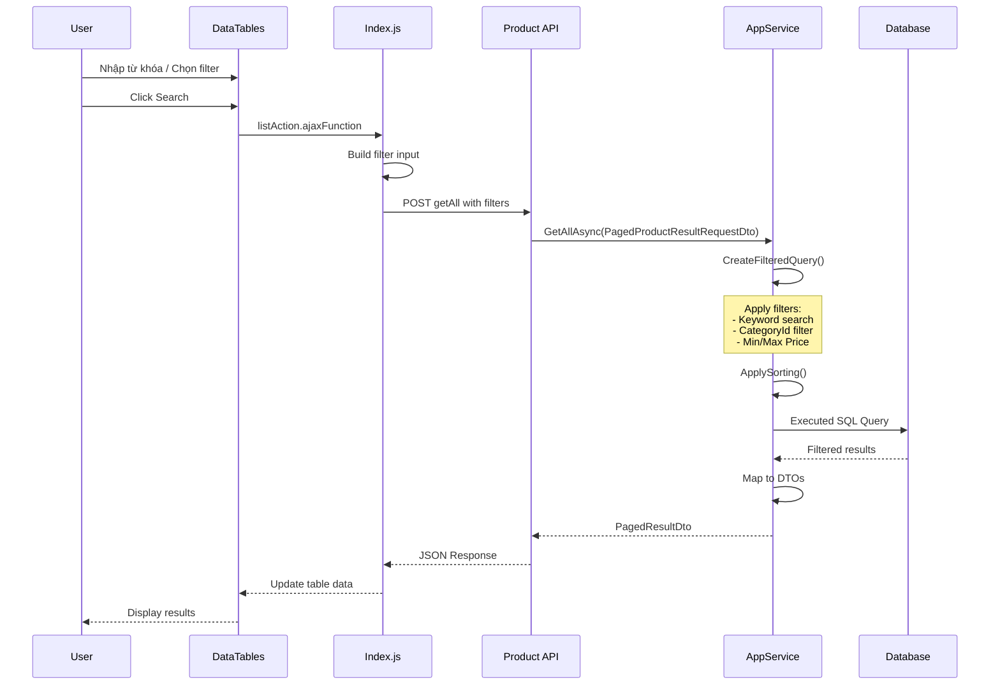
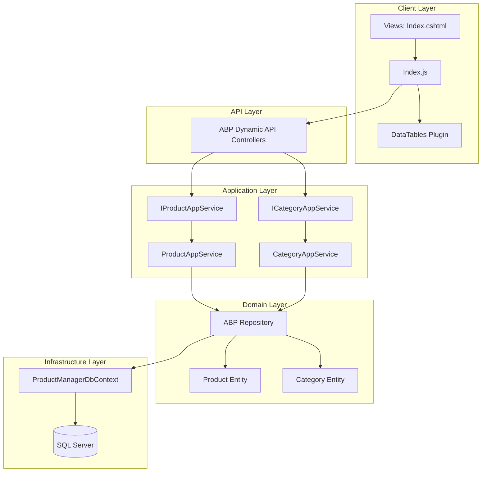
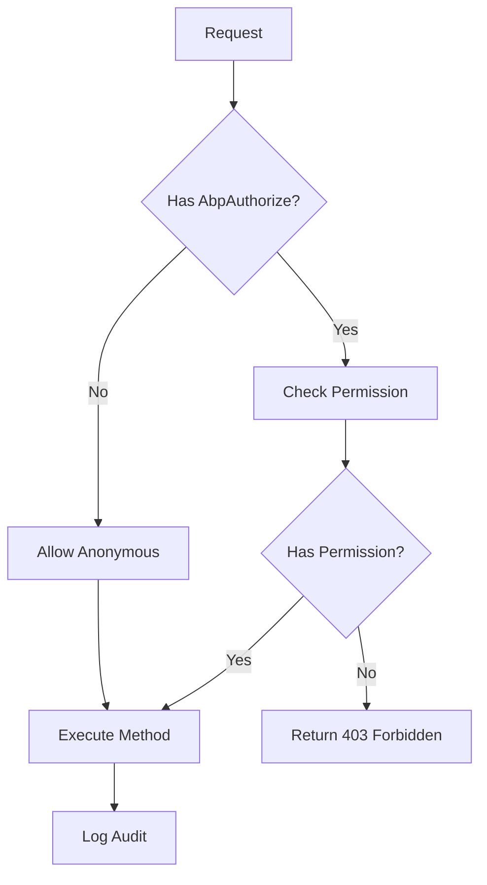

# ProductManager - Workflow Documentation

## Tổng quan luồng xử lý

Đây là mô tả chi tiết luồng chạy của chức năng quản lý sản phẩm từ giao diện người dùng đến database.

---

## 1. Luồng hiển thị danh sách sản phẩm

### Sequence Diagram



---

## 2. Luồng thêm mới sản phẩm



---

## 3. Luồng chỉnh sửa sản phẩm

```mermaid
flowchart TD
    A[User click Edit] --> B[JS: _productService.get({id})]
    B --> C[API: GET /product/get]
    C --> D[ProductAppService.GetAsync]
    D --> E[Repository.GetAsync]
    E --> F[Database Query]
    F --> G[Return ProductDto]
    G --> H[JS Fill form data]
    H --> I[Show Modal]
    I --> J[User Edit & Save]
    J --> K[JS: _productService.update]
    K --> L[API: PUT /product/update]
    L --> M[ProductAppService.UpdateAsync]
    M --> N[Check Permission]
    N --> O[Repository.UpdateAsync]
    O --> P[Database UPDATE]
    P --> Q[Return updated ProductDto]
    Q --> R[JS Reload DataTable]
    R --> S[Notify Success]
```

---

## 4. Luồng xóa sản phẩm



---

## 5. Luồng tìm kiếm và phân trang



---

## 6. Request Lifecycle chi tiết

### HTTP Request Flow

```
┌─────────────────────────────────────────────────────────────┐
│ 1. Browser Request                                          │
│    GET /api/services/app/product/getAll                     │
│    Headers: Authorization: Bearer <token>                   │
└─────────────────────────────────────────────────────────────┘
                            ↓
┌─────────────────────────────────────────────────────────────┐
│ 2. ASP.NET MVC Routing                                      │
│    ABP Dynamic API Controller chuyển tiếp đến AppService    │
└─────────────────────────────────────────────────────────────┘
                            ↓
┌─────────────────────────────────────────────────────────────┐
│ 3. Authorization Filter                                     │
│    [AbpAuthorize(PermissionNames.Pages_Products)]           │
│    Kiểm tra user có quyền truy cập không                    │
└─────────────────────────────────────────────────────────────┘
                            ↓
┌─────────────────────────────────────────────────────────────┐
│ 4. Model Binding                                            │
│    JSON Input → PagedProductResultRequestDto                 │
│    { keyword: "iphone", categoryId: 1, minPrice: 100 }       │
└─────────────────────────────────────────────────────────────┘
                            ↓
┌─────────────────────────────────────────────────────────────┐
│ 5. Application Service                                      │
│    ProductAppService.GetAllAsync()                          │
│    - CreateFilteredQuery()                                   │
│    - ApplySorting()                                         │
│    - MapToDto via AutoMapper                                 │
└─────────────────────────────────────────────────────────────┘
                            ↓
┌─────────────────────────────────────────────────────────────┐
│ 6. Repository Pattern                                       │
│    ABP Repository tự động handle:                            │
│    - Query execution                                        │
│    - Change tracking                                        │
│    - Transaction management                                 │
└─────────────────────────────────────────────────────────────┘
                            ↓
┌─────────────────────────────────────────────────────────────┐
│ 7. Entity Framework Core                                    │
│    DbContext translate LINQ → SQL                          │
│    Execute query với filter:                                │
│    WHERE Name LIKE '%iphone%' AND CategoryId = 1              │
└─────────────────────────────────────────────────────────────┘
                            ↓
┌─────────────────────────────────────────────────────────────┐
│ 8. Database (SQL Server)                                    │
│    Trả về records phù hợp                                  │
└─────────────────────────────────────────────────────────────┘
                            ↓
┌─────────────────────────────────────────────────────────────┐
│ 9. Response (Reverse flow)                                  │
│    Database → EF Core → Repository → AppService → JSON      │
│    { items: [...], totalCount: 50 }                         │
└─────────────────────────────────────────────────────────────┘
```

---

## 7. Component Interaction



---

## 8. Data Flow Summary

| Thao tác | Input | Processing | Output |
|----------|-------|------------|--------|
| **List** | Page, Filters | Query + Filter + Sort | PagedResultDto |
| **Get** | EntityDto<int> | Repository.Find | ProductDto |
| **Create** | CreateProductInput | MapToEntity + Insert | ProductDto |
| **Update** | ProductDto | MapToEntity + Update | ProductDto |
| **Delete** | EntityDto<int> | SoftDelete | void |

---

## 9. Security Flow


